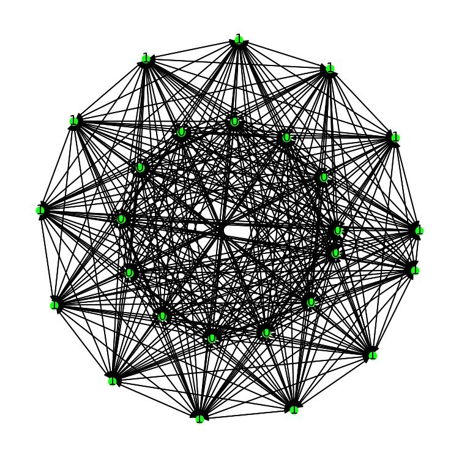
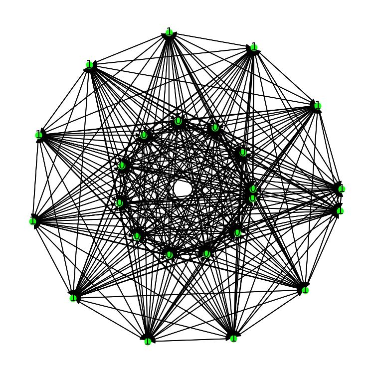
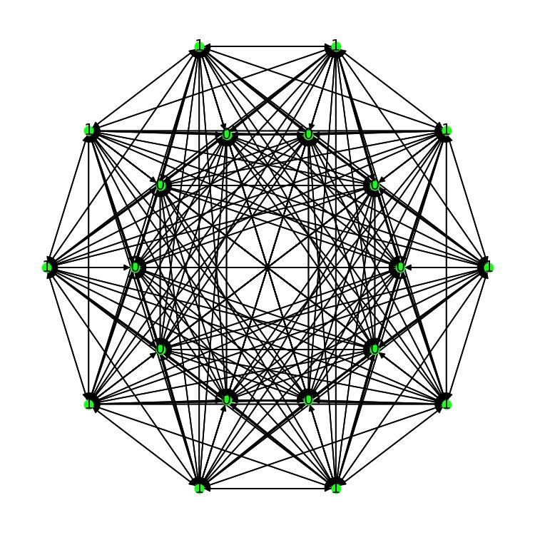

# DGL-Classify-Ring

这是一个DGL图神经库的入门例子。  
使用图神经网络来分类全连接图的节点是位于内环还是外环。  


This is an example of DGL graph neural library.  
Graph neural network is used to classify whether the nodes of a fully connected graph are located in the inner ring or the outer ring.  


有两条环状排列的节点，构造它们的全连接图，然后判断节点是属于内环还是属于外环。  
输入有两个，一个是节点自身的XY坐标，一个是节点之间的关系图。  
输出是一个onehot向量，只有两个结果，0或1。0代表为节点属于内环，1代表节点属于外环。  
然后数据集里面，每个图的都是长这样的，但是它们的内环和外环的半径各不相同，环的中心坐标也各不相同。  


There are two nodes arranged in a ring, construct their full connection graph, and then judge whether the nodes belong to the inner ring or the outer ring.  
There are two inputs, one is the XY coordinate of the node itself, and the other is the relationship graph between nodes.  
The output is a onehot vector with only two results, 0 or 1. 0 means that the node belongs to the inner ring, and 1 means that the node belongs to the outer ring.  
Then, in the dataset, each graph is long like this, but the radii of its inner and outer rings are different, and the central coordinates of the rings are also different.  


  
  
  


# Dependency / 依赖库
```txt
numpy >= 1.20
networkx >= 2.5.1
imageio >= 2.9.0
matplotlib >= 3.4.2
torch >= 1.8.1
dgl >= 0.6.1
```

# Start / 开始

非常简单，只需要克隆本仓库，使用以下命令启动即可。  
内外环图数据集会自动随机生成。  
网络会自动开始训练和验证。  
你可以在文件夹 show_dir 中看到训练中生成的图像。  

Very simple, just clone this repo and start it with the following command.
The inner and outer ring graph dataset is generated automatically and randomly.
The network will start training and verification automatically.
You can see the images generated during training in the folder "train_show_dir".

```bash
git clone https://github.com/One-sixth/DGL-Classify-Ring
cd ./DGL-Classify-Ring
python gnn_example.py
```
